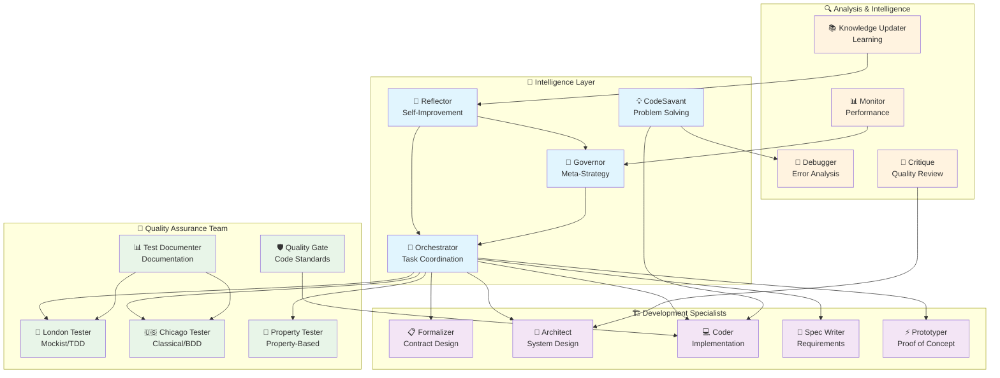

# 🧠 CortexWeaver 1.0

<div align="center">

[](https://github.com/cortexweaver/cortexweaver)
[](https://www.npmjs.com/package/cortexweaver)
[](LICENSE)
[](https://nodejs.org/)
[](https://www.typescriptlang.org/)

**🚀 The Next-Generation AI Agent Orchestration System**

*Intelligent • Modular • Production-Ready*

</div>

---

## ✨ What is CortexWeaver?

**CortexWeaver** is a revolutionary AI agent orchestration system that transforms how developers approach software projects. Instead of wrestling with complex tasks alone, CortexWeaver deploys **20+ specialized AI agents** that work together like a perfectly coordinated development team.

🎯 **Think of it as having a team of expert developers, each specializing in different aspects of software development, all working together seamlessly.**

📦 **Available on NPM:** https://www.npmjs.com/package/cortexweaver

## 🌟 Why Choose CortexWeaver?

### 🚀 For Developers
- ⚡ **10x faster development** with AI agent assistance
- 🧠 **Expert knowledge** across all development disciplines
- 🔄 **Automated workflows** from design to deployment
- 📚 **Learning accelerator** - learn from AI expertise
- 🛡️ **Quality assurance** built into every step

### 🏢 For Teams
- 🎯 **Consistent code quality** across all projects
- 📋 **Standardized processes** and documentation
- 🔍 **Built-in code review** and testing
- 📈 **Scalable development** practices
- 💰 **Cost-effective** compared to hiring specialists

---

## 🎥 See CortexWeaver in Action

```bash
# Initialize a new AI-powered project in seconds (no installation needed!)
$ npx cortexweaver init my-awesome-app
✨ Creating project structure with 20+ AI agents ready to assist...
📁 Setting up modular architecture...
🤖 Configuring specialized agents...
✅ Project ready! Your AI development team is standing by.

# Start building with AI assistance
$ npx cortexweaver start
🧠 CortexWeaver Orchestrator starting...
🏗️  Architect Agent: Analyzing requirements...
💻 Coder Agent: Ready for implementation...
🧪 Testing Agents: Quality assurance online...
📊 Monitor Agent: Performance tracking active...
🚀 Your AI development team is now working!
```

---

## 🚀 Quick Start

Choose your preferred installation method:

### ⚡ **Option 1: NPX (Instant - No Installation)**

```bash
# 1. Create your first AI-powered project (15 seconds)
mkdir my-project && cd my-project
npx cortexweaver init

# 2. Configure authentication (15 seconds)
npx cortexweaver auth configure

# 3. Start your AI development team! 🚀
npx cortexweaver start
```

### 📦 **Option 2: Global Installation**

```bash
# 1. Install globally (30 seconds)
npm install -g cortexweaver

# 2. Create your first AI-powered project (15 seconds)
mkdir my-project && cd my-project
cortex-weaver init

# 3. Configure authentication (15 seconds)
cortex-weaver auth configure

# 4. Start your AI development team! 🚀
cortex-weaver start
```

### 🔧 **Option 3: Development Setup**

```bash
# 1. Clone and install (60 seconds)
git clone https://github.com/mlbrilliance/CortexWeaver.git
cd CortexWeaver && npm install && npm run build

# 2. Create your first AI-powered project (15 seconds)
mkdir my-project && cd my-project
../CortexWeaver/dist/index.js init

# 3. Configure authentication (15 seconds)
../CortexWeaver/dist/index.js auth configure

# 4. Start your AI development team! 🚀
../CortexWeaver/dist/index.js start
```

### 📋 Prerequisites

| Requirement | Version | Purpose |
|-------------|---------|---------|
| 🟢 **Node.js** | ≥ 18.0.0 | Runtime environment |
| 🔧 **Git** | ≥ 2.25.0 | Worktree management |
| 🗄️ **Neo4j** | Latest | Knowledge graph (optional) |
| 🔑 **Claude API** | - | AI agent intelligence |

💡 **Pro Tip:** Use `npx cortexweaver doctor` or `cortex-weaver doctor` to check all prerequisites automatically!

---

## 🏗️ The Architecture That Powers Intelligence



### 🎯 How It Works

1. **🧠 You Define the Vision** - Write your requirements in simple `plan.md`
2. **🎯 Orchestrator Coordinates** - Intelligent task distribution across agents
3. **🤖 Agents Execute** - Specialized AI agents handle their expertise areas
4. **🌌 Knowledge Persists** - Cognitive Canvas learns and improves over time
5. **🔄 System Evolves** - Reflector agent continuously improves the process

---

## 🤖 The Agent Ecosystem

### 🌟 **20+ Specialized AI Agents at Your Service**

#### 🏗️ **Development Powerhouse**
- 👷 **Architect** - System design & API specs
- 💻 **Coder** - Implementation & programming  
- 📋 **Formalizer** - Contract specifications
- ⚡ **Prototyper** - Rapid concept validation
- 📝 **Spec Writer** - Requirements analysis

#### 🧪 **Quality Guardians**
- 🏴󠁧󠁢󠁥󠁮󠁧󠁿 **London Tester** - Mockist unit testing
- 🇺🇸 **Chicago Tester** - Integration testing
- 🎲 **Property Tester** - Property-based verification
- 🛡️ **Quality Gate** - Code quality enforcement
- 📊 **Test Documenter** - Test documentation

#### 🔍 **Intelligence Network**
- 👑 **Governor** - Budget & resource management
- 📊 **Monitor** - System health & performance
- 🐛 **Debugger** - Intelligent error resolution
- 📚 **Knowledge Updater** - Learning & improvement
- 🔄 **Reflector** - Process optimization

---

## 💡 Real-World Examples

### 🎮 Example 1: Building a REST API

#### Using NPX (Recommended)
```bash
# 1. Initialize project (no installation needed)
npx cortexweaver init my-api
cd my-api

# 2. Define your vision in plan.md
echo "Build a user management REST API with authentication" > plan.md

# 3. Let the AI team work!
npx cortexweaver start
```

#### Using Global Installation
```bash
# 1. Initialize project
cortex-weaver init my-api
cd my-api

# 2. Define your vision in plan.md
echo "Build a user management REST API with authentication" > plan.md

# 3. Let the AI team work!
cortex-weaver start
```

**What happens behind the scenes:**
- 👷 **Architect** designs the API structure and database schema
- 📋 **Formalizer** creates OpenAPI specifications  
- 💻 **Coder** implements endpoints and business logic
- 🧪 **Testing team** creates comprehensive test suites
- 🛡️ **Quality Gate** ensures code standards compliance
- 📊 **Monitor** sets up performance tracking

### 🌐 Example 2: Frontend Application

```bash
# Using NPX
npx cortexweaver init my-frontend
echo "React dashboard with real-time charts and user management" > plan.md
npx cortexweaver start --workflow=frontend --agents=architect,coder,london-tester

# Using Global Installation
cortex-weaver init my-frontend
echo "React dashboard with real-time charts and user management" > plan.md
cortex-weaver start --workflow=frontend --agents=architect,coder,london-tester
```

### 🔧 Example 3: Microservices Architecture

```bash
# Using NPX
npx cortexweaver init microservices-app
echo "E-commerce platform with user, product, and order services" > plan.md
npx cortexweaver start --parallel=5 --agents=all

# Using Global Installation
cortex-weaver init microservices-app
echo "E-commerce platform with user, product, and order services" > plan.md
cortex-weaver start --parallel=5 --agents=all
```

---

## 📖 Comprehensive Documentation

### 🎮 Available Commands

#### 🚀 **Project Management**

**Using NPX (No Installation Required):**
```bash
# Initialize new project
npx cortexweaver init [path]

# Check project health
npx cortexweaver status [path]

# Start AI orchestration
npx cortexweaver start [path]

# Monitor progress
npx cortexweaver logs <task-id>
```

**Using Global Installation:**
```bash
# Initialize new project
cortex-weaver init [path]

# Check project health
cortex-weaver status [path]

# Start AI orchestration
cortex-weaver start [path]

# Monitor progress
cortex-weaver logs <task-id>
```

#### 🔧 **Advanced Operations**

**Using NPX:**
```bash
# Authentication management
npx cortexweaver auth status
npx cortexweaver auth configure

# Agent management  
npx cortexweaver list-agents
npx cortexweaver retry <task-id>

# Project operations
npx cortexweaver merge <task-id>
npx cortexweaver attach <task-id>
```

**Using Global Installation:**
```bash
# Authentication management
cortex-weaver auth status
cortex-weaver auth configure

# Agent management  
cortex-weaver list-agents
cortex-weaver retry <task-id>

# Project operations
cortex-weaver merge <task-id>
cortex-weaver attach <task-id>
```

### 🎯 Basic Development Workflow

#### NPX Workflow (Recommended)
```bash
# 1. Project Setup
mkdir awesome-project && cd awesome-project
npx cortexweaver init

# 2. Authentication
npx cortexweaver auth status
# If needed: npx cortexweaver auth configure

# 3. Define Requirements
cat > plan.md << EOF
# My Awesome Project

## Goal
Build a task management API with the following features:

## Requirements
- User authentication and authorization
- CRUD operations for tasks
- Real-time notifications
- Database persistence
- API documentation

## Acceptance Criteria
- RESTful API design
- Input validation
- Error handling
- Comprehensive tests
- Docker deployment
EOF

# 4. Start Development
npx cortexweaver start

# 5. Monitor Progress
npx cortexweaver status
npx cortexweaver logs task-001
```

#### Global Installation Workflow
```bash
# 1. Install globally
npm install -g cortexweaver

# 2. Project Setup
mkdir awesome-project && cd awesome-project
cortex-weaver init

# 3. Authentication
cortex-weaver auth status
# If needed: cortex-weaver auth configure

# 4. Define Requirements (same as above)
cat > plan.md << EOF
# My Awesome Project
## Goal
Build a task management API with the following features:
## Requirements
- User authentication and authorization
- CRUD operations for tasks
- Real-time notifications
- Database persistence
- API documentation
## Acceptance Criteria
- RESTful API design
- Input validation
- Error handling
- Comprehensive tests
- Docker deployment
EOF

# 5. Start Development
cortex-weaver start

# 6. Monitor Progress
cortex-weaver status
cortex-weaver logs task-001
```

---

## 🛠️ Advanced Configuration

### ⚙️ Project Configuration (.cortexweaver/config.json)

```json
{
  "project": {
    "name": "my-awesome-project",
    "version": "1.0.0",
    "type": "fullstack"
  },
  "ai": {
    "models": {
      "claude": "claude-3-opus-20240229",
      "fallback": "claude-3-sonnet-20240229"
    },
    "temperature": 0.7,
    "maxTokens": 4000
  },
  "budget": {
    "maxCost": 500,
    "dailyLimit": 50,
    "warningThreshold": 80
  },
  "agents": {
    "preferred": ["architect", "coder", "london-tester"],
    "maxConcurrent": 3,
    "specializations": {
      "frontend": ["architect", "coder", "london-tester"],
      "backend": ["architect", "formalizer", "coder", "chicago-tester"],
      "fullstack": ["architect", "coder", "london-tester", "chicago-tester"]
    }
  },
  "quality": {
    "codeStandards": "strict",
    "testCoverage": 80,
    "documentationRequired": true
  }
}
```

### 🔐 Environment Setup

```bash
# Core Configuration
export CLAUDE_API_KEY="your-claude-api-key"
export NODE_ENV="development"

# Optional Integrations
export NEO4J_URI="bolt://localhost:7687"
export NEO4J_USERNAME="neo4j"
export NEO4J_PASSWORD="your-password"

# GitHub Integration (optional)
export GITHUB_TOKEN="your-github-token"

# Advanced Settings
export CORTEX_LOG_LEVEL="info"
export CORTEX_MAX_PARALLEL_AGENTS="5"
export CORTEX_BUDGET_LIMIT="1000"
```

### 📁 Project Structure

```
my-project/
├── 📝 plan.md                          # Project requirements
├── 📋 contracts/                       # Formal specifications
│   ├── api-spec.yaml                   # OpenAPI specifications
│   ├── schema.json                     # Data schemas
│   └── requirements.md                 # Detailed requirements
├── 🤖 prompts/                         # Agent customization
│   ├── architect.md                    # Custom architect instructions
│   ├── coder.md                        # Custom coding standards
│   └── tester.md                       # Testing preferences
├── ⚡ prototypes/                       # Rapid development
│   ├── features/                       # Feature prototypes
│   ├── experiments/                    # Technical experiments
│   └── proofs-of-concept/              # Concept validation
├── ⚙️ .cortexweaver/                   # System configuration
│   ├── config.json                     # Project settings
│   ├── agent-history.json              # Learning data
│   └── performance-metrics.json        # Usage analytics
└── 📊 .cortex-history/                 # Knowledge persistence
    ├── cognitive-canvas.db              # Knowledge graph
    ├── agent-interactions.log           # Communication logs
    └── improvement-suggestions.json     # AI recommendations
```

---

## 🌟 What Makes CortexWeaver Special

### 🚀 **Production-Ready Architecture**

| Feature | Benefit | Impact |
|---------|---------|--------|
| 🧩 **Modular Design** | Easy maintenance & testing | 🟢 High |
| 📏 **500-Line Rule** | Enhanced readability | 🟢 High |  
| 🔒 **Type Safety** | Fewer runtime errors | 🟢 High |
| 🧪 **Comprehensive Tests** | Reliable deployments | 🟢 High |
| 📚 **Self-Documenting** | Reduced onboarding time | 🟡 Medium |

### 🎯 **Intelligent Features**

- **🧠 Cognitive Canvas**: AI agents learn from every project and improve over time
- **🔄 Self-Healing**: Automatic error detection and recovery
- **📊 Performance Monitoring**: Real-time insights into development progress
- **🎯 Smart Task Distribution**: Optimal agent assignment based on capabilities
- **💡 Continuous Learning**: System gets smarter with each project

### 🛡️ **Enterprise-Grade Security**

- **🔐 Secure API Management**: Encrypted credential storage
- **🔍 Code Review Integration**: Automated security scanning
- **📋 Audit Trails**: Complete activity logging
- **🚫 Permission Controls**: Role-based access management

---

## 🎓 Learning Resources

### 📚 **Getting Started Guides**

**👨‍💻 For Developers**
- [🚀 Quick Start Tutorial](docs/quick-start.md)
- [🤖 Agent Deep Dive](docs/agents.md)
- [⚙️ Configuration Guide](docs/configuration.md)
- [🔧 CLI Reference](docs/cli-reference.md)

**🏢 For Teams**
- [📋 Project Setup](docs/team-setup.md)
- [🎯 Workflow Optimization](docs/workflows.md)
- [📊 Performance Monitoring](docs/monitoring.md)
- [🛡️ Security Best Practices](docs/security.md)

### 💡 **Pro Tips**

1. **🎨 Customize Agent Personas**: Tailor agents to your coding style
2. **📊 Monitor Costs**: Use budget controls to optimize AI usage  
3. **🔄 Iterative Development**: Start small, let agents learn your preferences
4. **🧪 Test-Driven Approach**: Let testing agents guide development quality
5. **📚 Document Everything**: Agents learn from your documentation patterns

---

## 🤝 Community & Support

### 👥 **Connect with the Community**

[](https://github.com/cortexweaver/cortexweaver/issues)
[](https://github.com/cortexweaver/cortexweaver/discussions)
[](CONTRIBUTING.md)

### 🆘 **Need Help?**

- 🐛 **Bug Reports**: [Create an issue](https://github.com/cortexweaver/cortexweaver/issues/new?template=bug_report.md)
- 💡 **Feature Requests**: [Request features](https://github.com/cortexweaver/cortexweaver/issues/new?template=feature_request.md)
- ❓ **Questions**: [Start a discussion](https://github.com/cortexweaver/cortexweaver/discussions)
- 📖 **Documentation**: [Browse the wiki](https://github.com/cortexweaver/cortexweaver/wiki)

---

## 🏆 Created By

<div align="center">

### **Nick Sudh**

[](https://nicksudh.com)
[](https://github.com/nicksudh)

*Passionate about AI, automation, and making developers more productive through intelligent tooling.*

**"Building the future of AI-assisted development, one agent at a time."**

</div>

---

## 📄 License & Credits

<div align="center">

[](LICENSE)

**CortexWeaver 1.0** is open source software licensed under the MIT license.

Built with ❤️ by [Nick Sudh](https://nicksudh.com) and the CortexWeaver community.

### 🙏 **Acknowledgments**

- 🤖 **Anthropic** for Claude AI capabilities
- 🧠 **Neo4j** for knowledge graph technology  
- 🛠️ **TypeScript** for type safety and developer experience
- 👥 **Open Source Community** for inspiration and collaboration

</div>

---

<div align="center">

### 🚀 **Ready to Transform Your Development Process?**

#### ⚡ **Instant Start with NPX (Recommended)**
```bash
# No installation needed - get started in seconds!
npx cortexweaver init my-ai-project
cd my-ai-project
npx cortexweaver start
```

#### 📦 **Install from NPM**
```bash
# Global installation
npm install -g cortexweaver
cortex-weaver init my-ai-project
cd my-ai-project
cortex-weaver start
```

#### 🔧 **Development Setup**
```bash
# From source
git clone https://github.com/mlbrilliance/CortexWeaver.git
cd CortexWeaver && npm install && npm run build
mkdir my-ai-project && cd my-ai-project
../CortexWeaver/dist/index.js init
```

**Start building with 20+ AI agents today!** 🤖✨

[](https://www.npmjs.com/package/cortexweaver) • [⭐ Star this project](https://github.com/mlbrilliance/CortexWeaver) • [🔗 Share with friends](https://twitter.com/intent/tweet?text=Check%20out%20CortexWeaver%20-%20AI%20agent%20orchestration%20for%20developers!&url=https://www.npmjs.com/package/cortexweaver) • [📖 Read the docs](docs/)

</div>

---

<div align="center">
<sub>

**CortexWeaver** - Intelligent AI Agent Orchestration System  
*Empowering developers with specialized AI agents for better, faster, smarter development.*

Made with 🧠 and ⚡ by [Nick Sudh](https://nicksudh.com)

</sub>
</div>